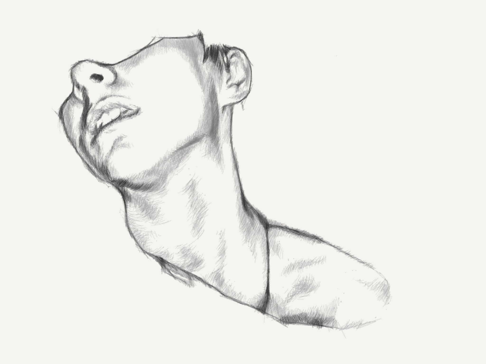
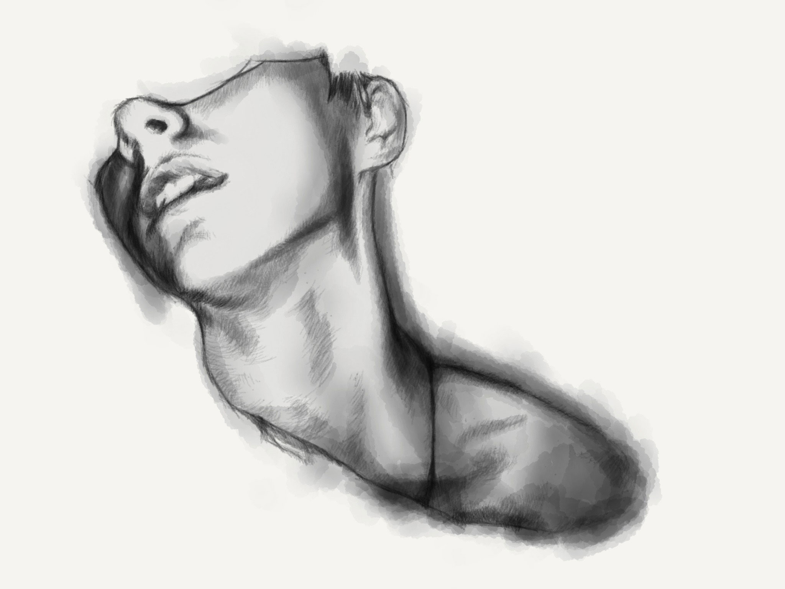
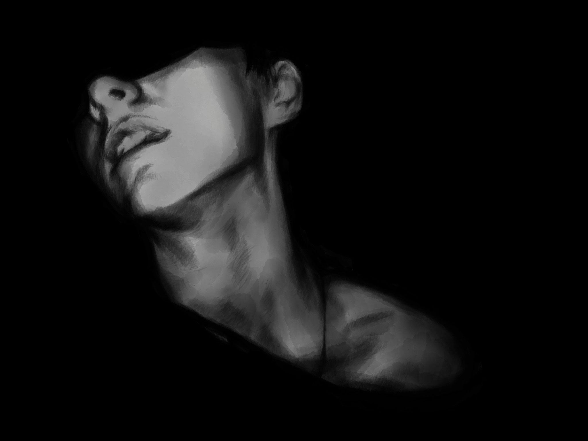

PaperFaces portrait of Becca P.J. inspired by a [photograph on Sktchy](https://sktchy.com/WCFVrC).

There's something about the look of [white on dark](https://mix.fiftythree.com/11098-Michael-Rose/3471365) that I really enjoy. Perhaps it's the chalky like quality of Paper's soft lead pencil tool that appeals to me?

**Tools used:**

- [Pencil by FiftyThree](https://www.amazon.com/FiftyThree-Digital-Stylus-Pencil-iPhone/dp/B01JJBUYR4/ref=as_li_ss_tl?keywords=pencil+53&qid=1550586265&s=gateway&sr=8-3&linkCode=ll1&tag=mademist-20&linkId=0134793cb840affff60f2e45a7f64678&language=en_US)
- [Paper for iOS](https://paper.bywetransfer.com/)
