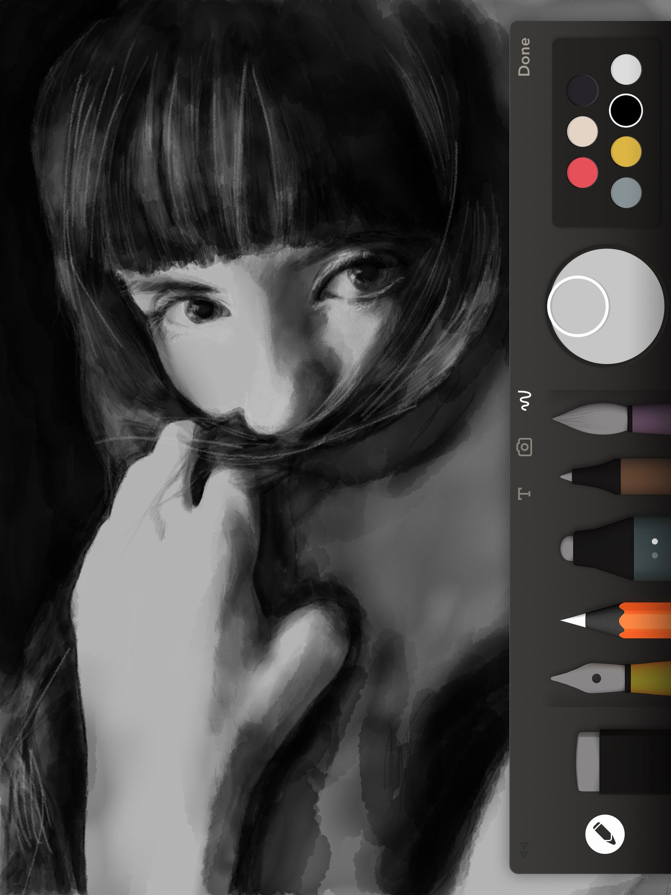
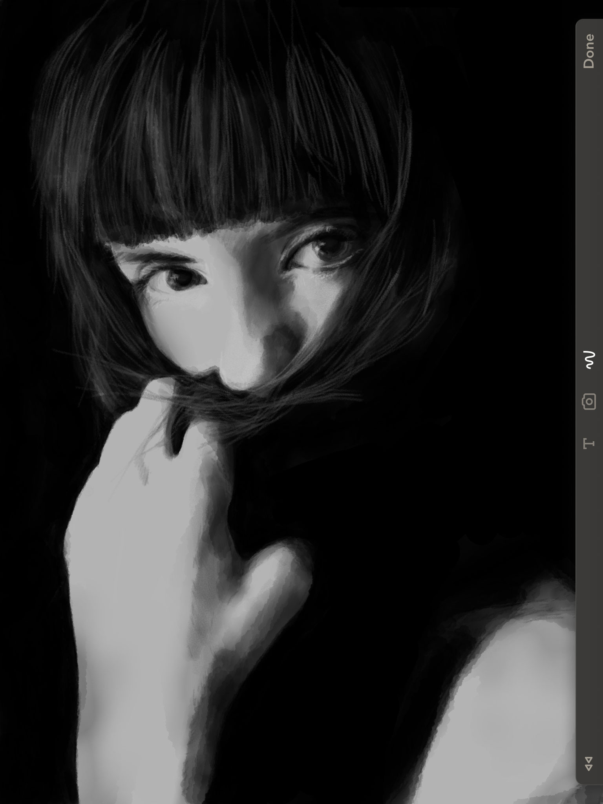
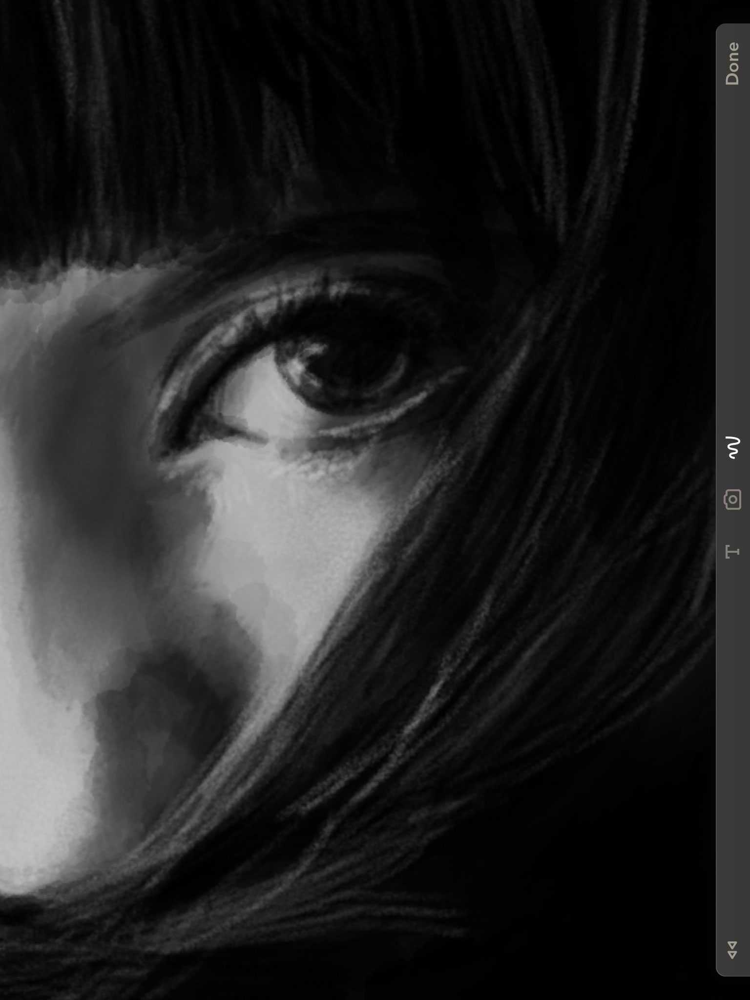

PaperFaces portrait of Brooke T. inspired by a [photograph on Sktchy](https://sktchy.com/S3B8m).

My [first drawing](https://paper.fiftythree.com/11098-Michael-Rose/5492331) completed with version 3.0 of Paper by FiftyThree. So far really enjoying the full screen zoom just wish it had more levels of magnification.

**Tools used:**

- [Pencil by FiftyThree](https://www.amazon.com/FiftyThree-Digital-Stylus-Pencil-iPhone/dp/B01JJBUYR4/ref=as_li_ss_tl?keywords=pencil+53&qid=1550586265&s=gateway&sr=8-3&linkCode=ll1&tag=mademist-20&linkId=0134793cb840affff60f2e45a7f64678&language=en_US)
- [Paper for iOS](https://paper.bywetransfer.com/)
