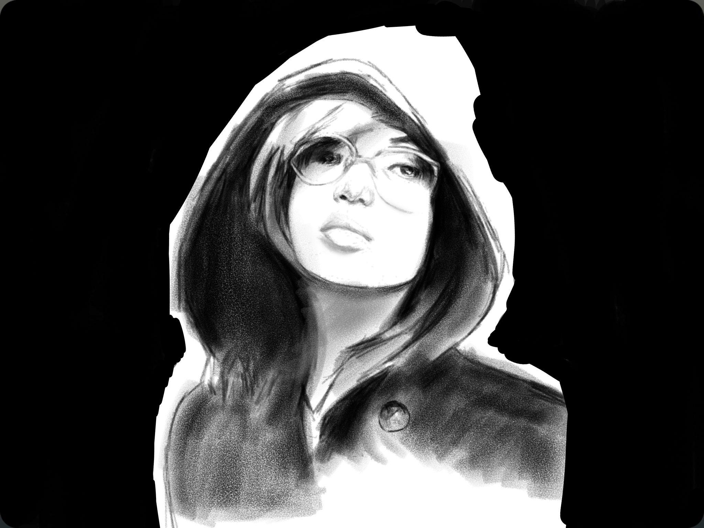
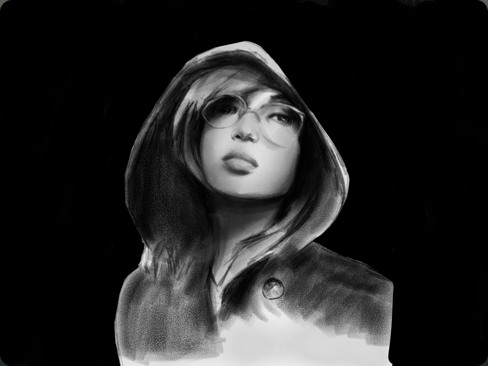

PaperFaces portrait of Danya W. inspired by a [photograph on Sktchy](https://sktchy.com/NjZR3H).

Lately I've been drawn to images of figures partially obscured by shadow. I find it easier to work them into a composition that covers the entirety of Paper's digital canvas.

**Tools used:**

- [Pencil by FiftyThree](https://www.amazon.com/FiftyThree-Digital-Stylus-Pencil-iPhone/dp/B01JJBUYR4/ref=as_li_ss_tl?keywords=pencil+53&qid=1550586265&s=gateway&sr=8-3&linkCode=ll1&tag=mademist-20&linkId=0134793cb840affff60f2e45a7f64678&language=en_US)
- [Paper for iOS](https://paper.bywetransfer.com/)
