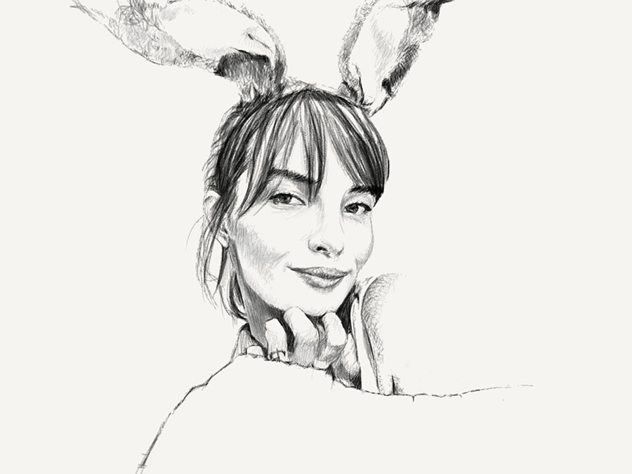

PaperFaces portrait of Eliza T. inspired by a [photograph on Sktchy](https://sktchy.com/FsO57C).

The more I use Paper's pencil and watercolor tools the more I want to pick up my old art supplies. Someday I suppose...

**Tools used:**

- [Pencil by FiftyThree](https://www.amazon.com/FiftyThree-Digital-Stylus-Pencil-iPhone/dp/B01JJBUYR4/ref=as_li_ss_tl?keywords=pencil+53&qid=1550586265&s=gateway&sr=8-3&linkCode=ll1&tag=mademist-20&linkId=0134793cb840affff60f2e45a7f64678&language=en_US)
- [Paper for iOS](https://paper.bywetransfer.com/)




