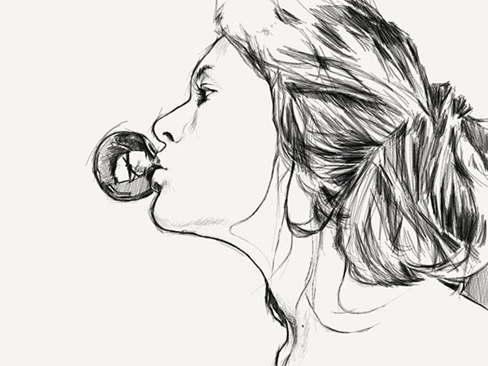
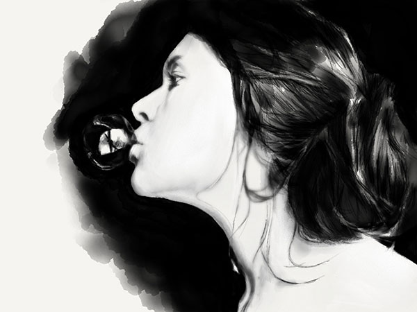

PaperFaces portrait of Kapi M. inspired by a [photograph on Sktchy](https://sktchy.com/udfGaD).

Now that I've removed the sense of urgency I previously felt when working on portraits, I find myself having more time to fill Paper's digital canvas. With this drawing I set my sights on an eye... har har get it?

It's [been a while since I drew one](/tag/eye/) and thought it might be fun to challenge myself and see how much detail I could knock out. The contours got away from me in a few places since I still find blending imprecise and over aggressive, but that's to be expected with a tool like Paper.

Overall I'm happy with the finished results, especially when you reduced the size of the drawing --- it looks just like a photograph!

**Tools used:**

- [Pencil by FiftyThree](https://www.amazon.com/FiftyThree-Digital-Stylus-Pencil-iPhone/dp/B01JJBUYR4/ref=as_li_ss_tl?keywords=pencil+53&qid=1550586265&s=gateway&sr=8-3&linkCode=ll1&tag=mademist-20&linkId=0134793cb840affff60f2e45a7f64678&language=en_US)
- [Paper for iOS](https://paper.bywetransfer.com/)


  
  
  
