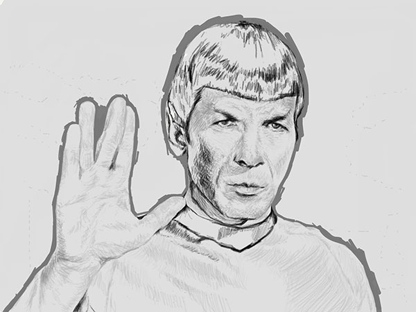
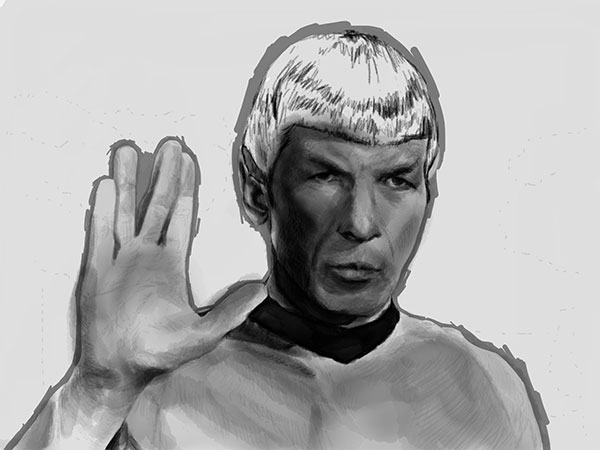
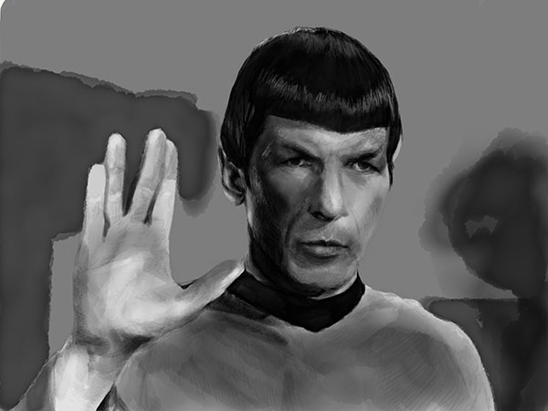

PaperFaces portrait tribute of Leonard Nimoy as Mr. Spock.

I worked on this drawing for little over 3 hours during two sittings. The best part of using [**Lapse It**](http://www.lapseit.com/) to generate time lapse videos of my work... playing them for the first time. 

Getting pretty close to a setup that works well for me, just need to nail down the lighting next. As anyone who's tried to photograph an iPad's screen, it can be tricky getting exposure and white balance right.

`youtube: https://www.youtube.com/watch?v=qhEtbFlxfm4`

**Tools used:**

- [Pencil by FiftyThree](https://www.amazon.com/FiftyThree-Digital-Stylus-Pencil-iPhone/dp/B01JJBUYR4/ref=as_li_ss_tl?keywords=pencil+53&qid=1550586265&s=gateway&sr=8-3&linkCode=ll1&tag=mademist-20&linkId=0134793cb840affff60f2e45a7f64678&language=en_US)
- [Paper for iOS](https://paper.bywetransfer.com/)
- [Lapse It](http://www.lapseit.com/)
