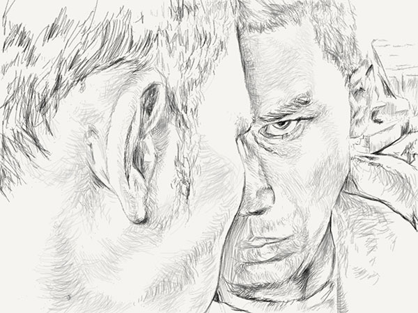
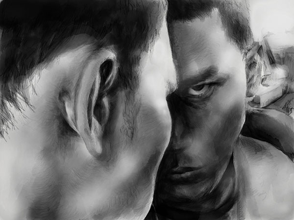

PaperFaces portrait of Rafi Z. inspired by a [photograph on Sktchy](https://sktchy.com/WsDAeD).

Another experiment in recording my drawing process using on iPad, recorded with an iPhone 5s and the Lapse It app. Drawing was completed over three sessions totaling 3 hours and 25 minutes.


`youtube: https://www.youtube.com/watch?v=i5DUn3K60eg`



 


#### Tools used

- [Pencil by FiftyThree](https://www.amazon.com/FiftyThree-Digital-Stylus-Pencil-iPhone/dp/B01JJBUYR4/ref=as_li_ss_tl?keywords=pencil+53&qid=1550586265&s=gateway&sr=8-3&linkCode=ll1&tag=mademist-20&linkId=0134793cb840affff60f2e45a7f64678&language=en_US)
- [Paper for iOS](https://paper.bywetransfer.com/)
- [Lapse It](http://www.lapseit.com/)
