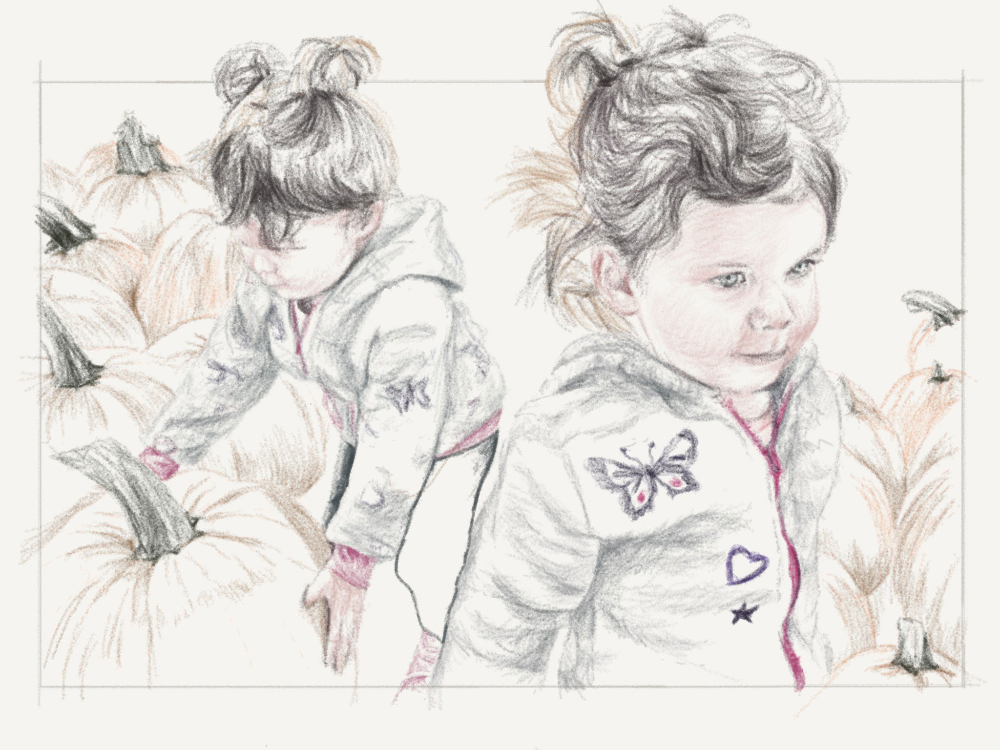
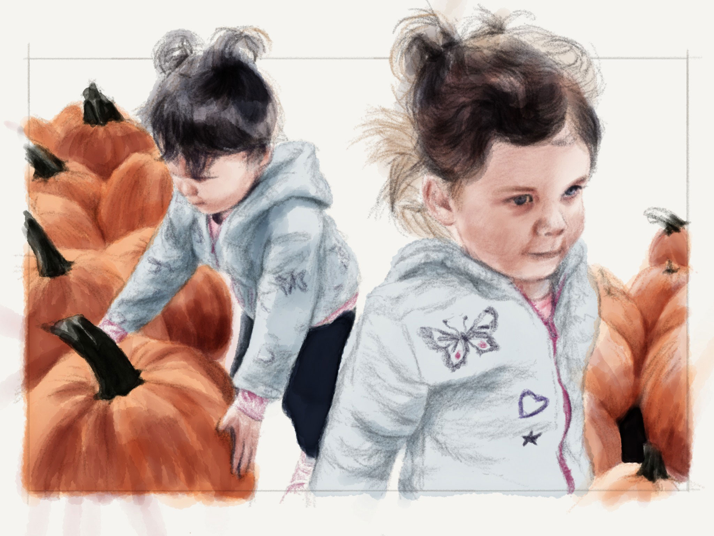
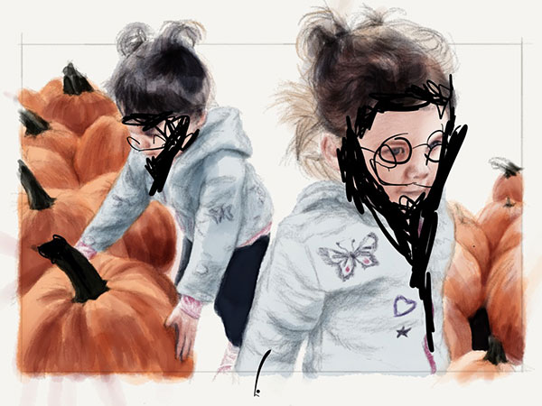
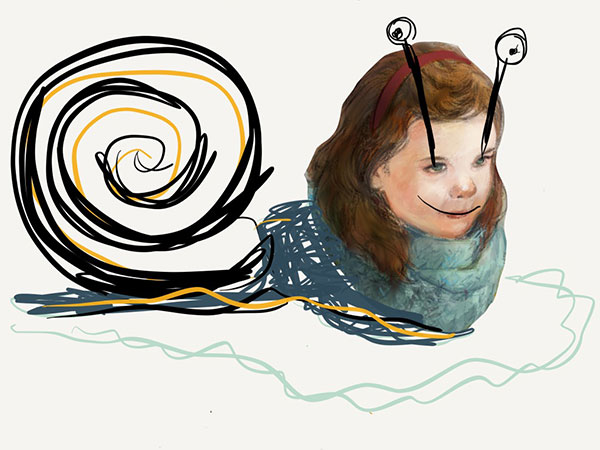

Last weekend Wendy and me took the girls to the Great Pumpkin Farm for the second time this autumn.

The first visit I took a bunch of photographs with my Canon EOS XTi camera but didn't feel like lugging it around this time. So using a few snaps from my iPhone 5S I combined my favorites into a new composition and drew it in [Paper for iPad](https://www.fiftythree.com/paper).

I'm really enjoying [sharing my creations on Mix](/mastering-paper/mix-with-me/) and have been trying to include them at [various stages of completeness](https://mix.fiftythree.com/11098-Michael-Rose/418184).

The best part is seeing what others do with them when remixed. I know some other creators in the Paper community have had their reservations about joining Mix. Personally the thought of someone making money off of my work or an immature kid defacing my drawings doesn't concern me. That kind of comes with the territory in this connected world we now live in --- whether you're sharing on Mix or not.

**Tools used:**

- [Pencil by FiftyThree](https://www.amazon.com/FiftyThree-Digital-Stylus-Pencil-iPhone/dp/B01JJBUYR4/ref=as_li_ss_tl?keywords=pencil+53&qid=1550586265&s=gateway&sr=8-3&linkCode=ll1&tag=mademist-20&linkId=0134793cb840affff60f2e45a7f64678&language=en_US)
- [Paper for iOS](https://paper.bywetransfer.com/)
