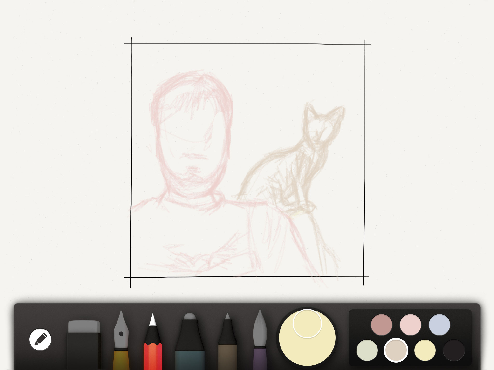
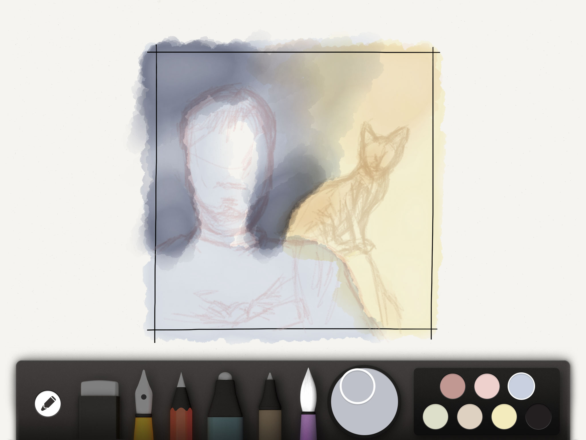
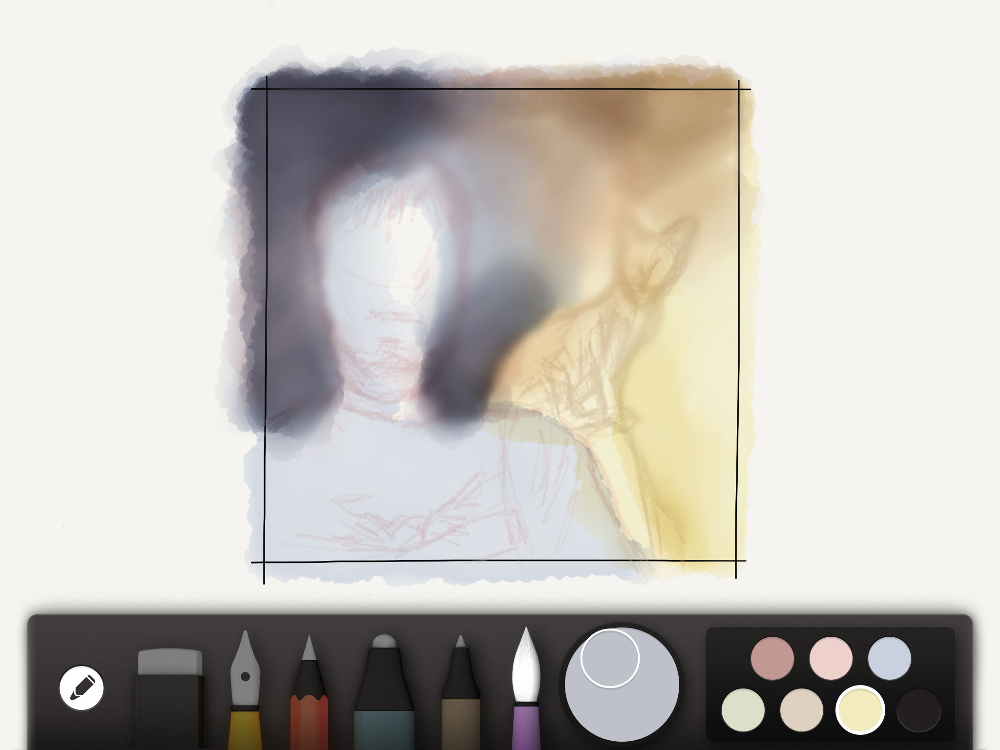
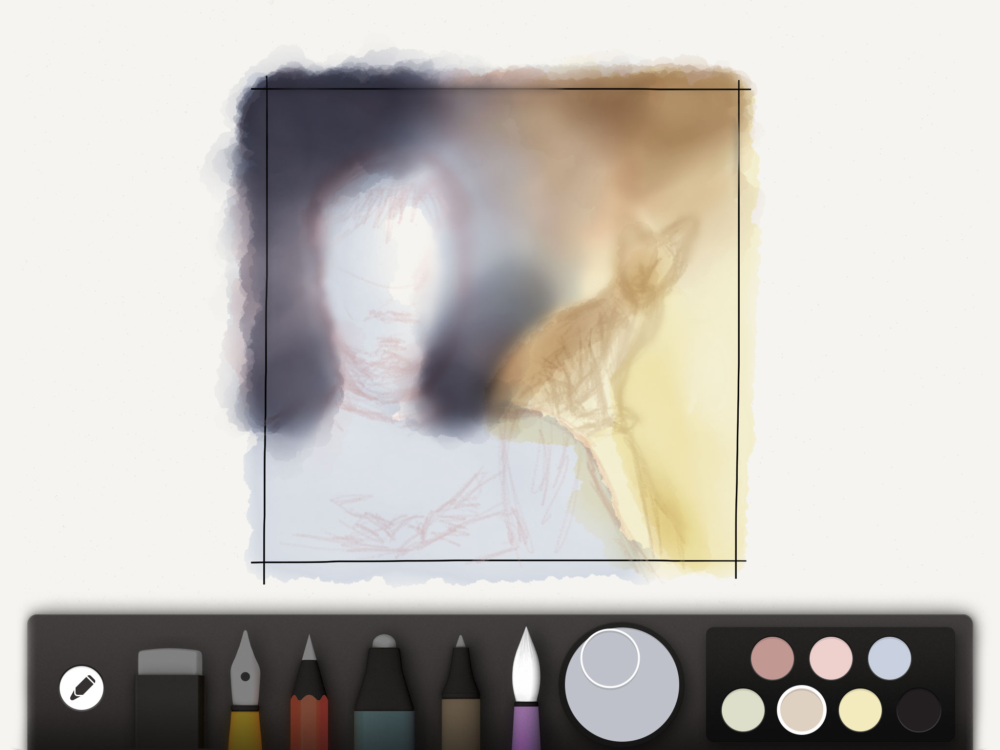
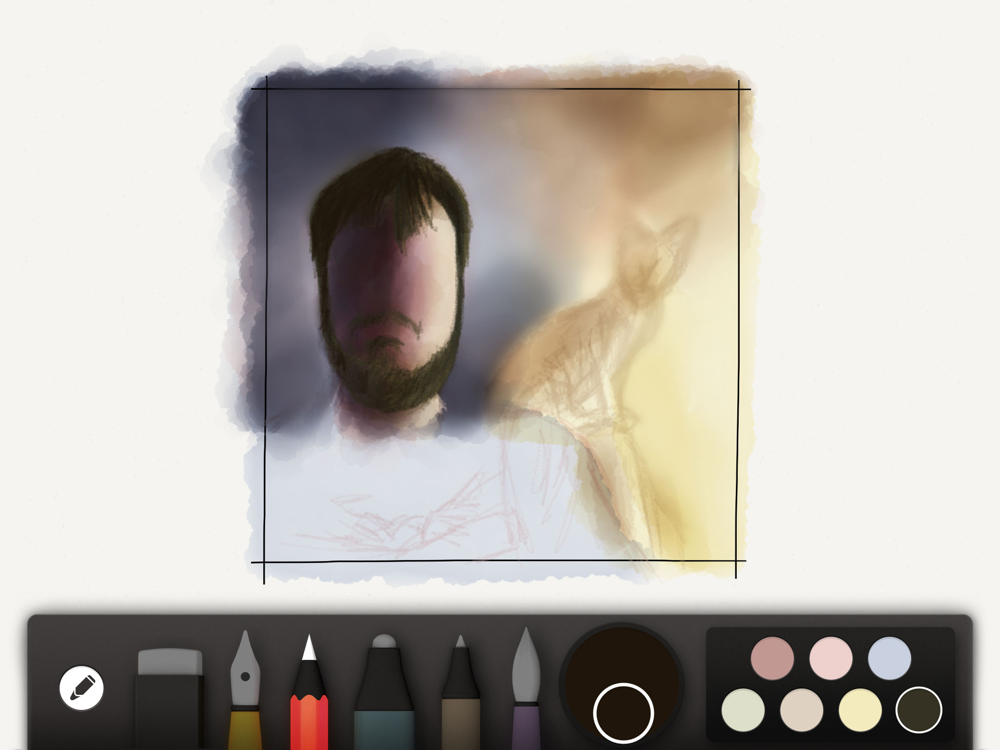
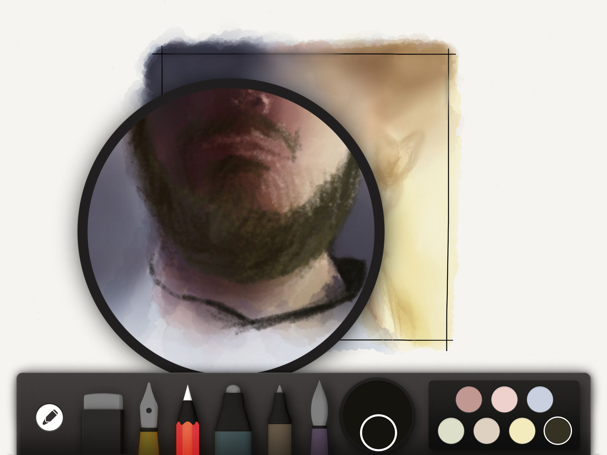
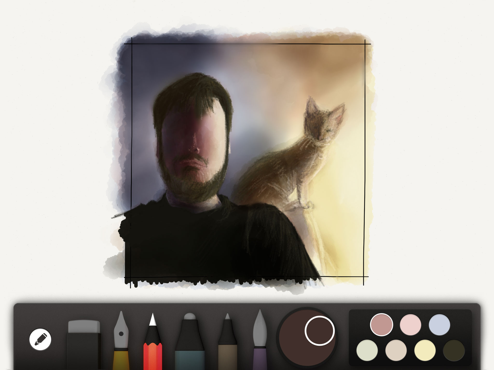

Blend is one of those tools that can easily be abused. Trying to limit its use to avoid going too soft and blurring brush strokes painted in Paper and retain character. I've found that blending colors and then applying a layer of light watercolor on top has a nice look.

PaperFaces portrait of [@sendapalic](https://twitter.com/sendapalic).

**Tools used:**

- [Pencil by FiftyThree](https://www.amazon.com/FiftyThree-Digital-Stylus-Pencil-iPhone/dp/B01JJBUYR4/ref=as_li_ss_tl?keywords=pencil+53&qid=1550586265&s=gateway&sr=8-3&linkCode=ll1&tag=mademist-20&linkId=0134793cb840affff60f2e45a7f64678&language=en_US)
- [Paper for iOS](https://paper.bywetransfer.com/)
