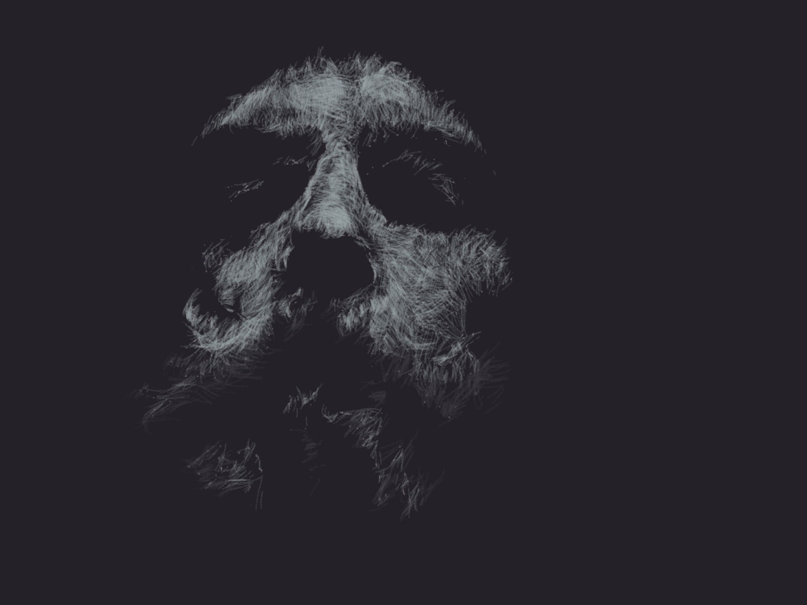

PaperFaces portrait of Sus Pek inspired by a [photograph on Sktchy](https://sktchy.com/ucx5rc).

I'm a sucker for dramatic lit faces and have more queued up than I have time to draw. This one in particular stuck out to me while listening to **Xasthur** on repeat. The skull like visage and grit found in the original image didn't hurt either... 

**Tools used:**

- [Pencil by FiftyThree](https://www.amazon.com/FiftyThree-Digital-Stylus-Pencil-iPhone/dp/B01JJBUYR4/ref=as_li_ss_tl?keywords=pencil+53&qid=1550586265&s=gateway&sr=8-3&linkCode=ll1&tag=mademist-20&linkId=0134793cb840affff60f2e45a7f64678&language=en_US)
- [Paper for iOS](https://paper.bywetransfer.com/)
